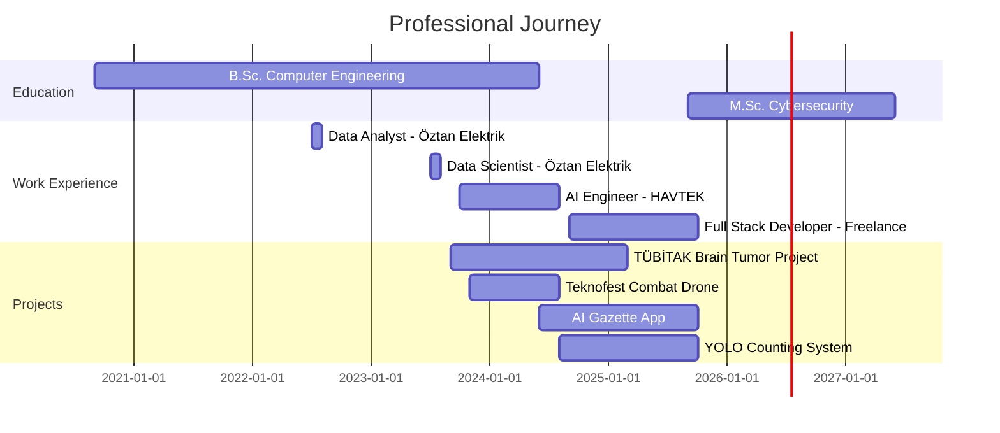

<div align="center">

<!-- Header Banner -->


<!-- Typing Animation -->
<a href="https://git.io/typing-svg"></a>

<!-- Social Badges -->
<p align="center">
  <a href="https://www.linkedin.com/in/mehmet-%C5%9Fakir-kurt-36339b1b2/">
    
  </a>
  <a href="https://www.kaggle.com/mehmetakirkurtt">
    
  </a>
  <a href="mailto:mehmetsakirkurtt@gmail.com">
    
  </a>
  <a href="https://www.instagram.com/mehmetsakirkurt/">
    
  </a>
</p>

<!-- Visitor Badge & Profile Views -->
<p align="center">
  
  
</p>

</div>

---

## 🚀 About Me


```python
class MehmetSakirKurt:
    def __init__(self):
        self.name = "Mehmet Şakir Kurt"
        self.role = "AI Engineer & Full Stack Developer"
        self.location = "Kayseri, Turkey 🇹🇷"
        self.education = {
            "current": "M.Sc. Cybersecurity @ Kayseri University",
            "focus": ["AI Security", "Blockchain Security", 
                     "ML Security", "Cyber Threat Intelligence"],
            "completed": "B.Sc. Computer Engineering"
        }
        
    def current_work(self):
        return [
            "🤖 AI-Powered Applications with LLM Integration",
            "👁️ Real-time Computer Vision Systems",
            "📱 Cross-platform Mobile Development",
            "🔐 AI Security & Blockchain Research"
        ]
    
    def tech_stack(self):
        return {
            "ai_ml": ["TensorFlow", "PyTorch", "YOLO", "U-Net"],
            "frontend": ["React", "React Native", "TypeScript"],
            "backend": ["FastAPI", "Node.js", "Supabase"],
            "tools": ["Docker", "N8N", "MCP", "CUDA"],
            "hardware": ["NVIDIA Jetson Xavier", "Raspberry Pi"]
        }
```

<br clear="right"/>

### 🎯 Quick Highlights

- 🎓 **Master's Student** in Cybersecurity with focus on AI Security
- 🤖 **Former AI Software Engineer** at ERÜ Aviation Technologies Team (HAVTEK)
- 🏆 **TÜBİTAK 2209-B** Research Project - U-Net Based Brain Tumor Diagnosis
- 🥇 **Teknofest 2024** Participant - Combat Drone Image Processing
- 💼 **Freelance Full Stack Developer** specializing in AI-powered applications
- 📊 **Data Science Background** with Big Data & Analytics experience

---

## 💼 Featured Projects

<table>
<tr>
<td width="50%">

### 🤖 AI-Powered Official Gazette App
[](https://github.com)

**Tech Stack:**
- React Native, TypeScript
- LLM Integration (OpenAI)
- Supabase Backend
- N8N Automation
- MCP Protocol

**Features:**
- 📱 Cross-platform (iOS/Android)
- 🧠 Intelligent Search with NLP
- 🔍 Auto Classification
- 📊 Real-time Notifications

</td>
<td width="50%">

### 🏭 YOLO Factory Counting System
[](https://github.com)

**Tech Stack:**
- YOLO v8
- React + TypeScript
- FastAPI
- Supabase
- Computer Vision

**Features:**
- 🎯 Real-time Detection
- 📊 Dashboard Analytics
- 📷 Camera Stream Processing
- 📈 Accuracy Optimization

</td>
</tr>

<tr>
<td width="50%">

### 🧠 Brain Tumor Diagnosis (TÜBİTAK)
[](https://github.com)

**Tech Stack:**
- U-Net Architecture
- PyTorch
- Medical Imaging
- Transfer Learning

**Achievements:**
- 🎯 High-accuracy segmentation
- 🏥 Clinical decision support
- 📊 MRI image analysis

</td>
<td width="50%">

### 🛸 Combat Drone Vision (Teknofest)
[](https://github.com)

**Tech Stack:**
- YOLO Object Detection
- NVIDIA Jetson Xavier
- PyQt5 GUI
- GPS Integration

**Achievements:**
- ⚡ Real-time processing
- 🎯 Target identification
- 🏆 Teknofest 2024

</td>
</tr>
</table>

---

## 🛠️ Technology Stack

### 💻 Programming Languages

<p align="left">
  
  
  
  
  
  
  
</p>

### 🤖 AI & Machine Learning

<p align="left">
  
  
  
  
  
  
  
  
</p>

### 🎨 Frontend Development

<p align="left">
  
  
  
  
  
</p>

### ⚙️ Backend Development

<p align="left">
  
  
  
  
</p>

### 🗄️ Databases

<p align="left">
  
  
  
</p>

### 🔧 DevOps & Tools

<p align="left">
  
  
  
  
  
  
</p>

### 📊 Data Science & Analytics

<p align="left">
  
  
  
  
  
</p>

### 🔌 Hardware & Embedded Systems

<p align="left">
  
  
  
</p>

---

## 📊 GitHub Analytics

<div align="center">
  
  
</div>

<div align="center">
  
</div>

<div align="center">
  
</div>

---

## 🏆 GitHub Trophies

<div align="center">
  
</div>

---

## 📈 Contribution Graph

<div align="center">
  
</div>

---

## 🎓 Education & Certifications

<table>
<tr>
<td width="50%">

### 🎓 Education

**🔐 M.Sc. in Cybersecurity**  
📍 Kayseri University (2025-2027)  
🎯 Focus: AI Security, Blockchain Security

**💻 B.Sc. in Computer Engineering**  
📍 Erciyes University (2023-2024)  
📍 Turgut Özal University (2020-2023)  
📊 GPA: 3.23/4.00

</td>
<td width="50%">

### 📜 Certifications

✅ **AI Expertise Program**  
   Ministry of Industry & Technology (Dec 2023)

✅ **Data Analyst Bootcamp**  
   Istanbul Data Science Academy (Jan 2023)

✅ **Advanced English Communication**  
   Code-Switching Method (Aug 2023)

✅ **Software Development Bootcamp**  
   SQL Training (Nov 2021)

</td>
</tr>
</table>

---

## 💼 Professional Experience Timeline



---

## 🌟 Skills & Expertise

<div align="center">

| Category | Skills | Proficiency |
|----------|--------|-------------|
| **AI/ML** | Deep Learning, Computer Vision, NLP, LLM | ████████████████████ 100% |
| **Frontend** | React, React Native, TypeScript | ██████████████████░░ 90% |
| **Backend** | FastAPI, Node.js, Supabase | ███████████████████░ 95% |
| **Data Science** | Pandas, Spark, Big Data, Analytics | █████████████████░░░ 85% |
| **DevOps** | Docker, Git, CI/CD, Cloud | ██████████████████░░ 90% |
| **Hardware** | Jetson Xavier, Embedded Systems | ████████████████░░░░ 80% |
| **Cybersecurity** | AI Security, Blockchain, Threat Intel | ███████████████░░░░░ 75% |

</div>

---

## 🤝 Connect With Me

<div align="center">

### 💬 Let's Collaborate on Innovative Projects!

I'm passionate about AI, Computer Vision, and building intelligent systems.  
Always open to interesting projects and collaborations!

<table align="center">
  <tr>
    <td align="center">
      <a href="https://www.linkedin.com/in/mehmet-%C5%9Fakir-kurt-36339b1b2/">
        
        <br><b>LinkedIn</b>
      </a>
    </td>
    <td align="center">
      <a href="mailto:mehmetsakirkurtt@gmail.com">
        
        <br><b>Email</b>
      </a>
    </td>
    <td align="center">
      <a href="https://www.kaggle.com/mehmetakirkurtt">
        
        <br><b>Kaggle</b>
      </a>
    </td>
    <td align="center">
      <a href="https://www.instagram.com/mehmetsakirkurt/">
        
        <br><b>Instagram</b>
      </a>
    </td>
  </tr>
</table>

<br>

### 📧 Contact Information

📍 **Location:** Kayseri, Turkey 🇹🇷  
📧 **Email:** mehmetsakirkurtt@gmail.com  
🌐 **GitHub:** github.com/MehmetSakirKurt

</div>

---

<div align="center">

### 💭 Professional Quote

*"Building the future with AI, one line of code at a time"* 🚀

---

### ⚡ Fun Facts

🎯 Teknofest 2024 Participant | 🏆 TÜBİTAK Researcher | 🤖 AI Enthusiast  
🚁 UAV Technology | 🔐 Cybersecurity Student | 📊 Data Science Expert

---

<!-- Snake Animation -->


---

**⭐ From [MehmetSakirKurt](https://github.com/mehmetsakirkurt)**


</div>
